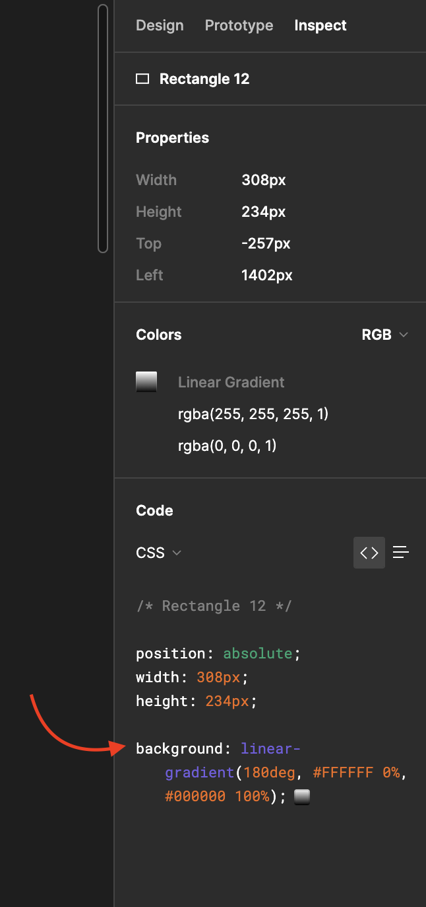

# Figma gradient to Tailwind CSS

 <p align="justify">
    This project is a simple function that takes a background string from figma and converts it to a JIT background class for Tailwind CSS. 
    <br />
    <br />
</p>

[](https://github.com/ellerbrock/typescript-badges/)
[](https://github.com/semantic-release/semantic-release)



<br>

### Installation

You can either use this package as a CLI with the following command:

```bash
npx fgtw "<YOUR_BACKGROUND_STRING_FROM_FIGMA>
```

Or you can install it as a package and use it in your code:

```bash
npm install fgtw
yarn add fgtw
pnpm add fgtw
```

<br>

### How to use

- Open your Figma file
- Select the element you want to get the gradient from
- Select the "Inspect" tab
- Copy the full background string ex: `background: linear-gradient(180deg, #FFFFFF 0%, #000000 100%);`
- Then you can either
    - Use the CLI with the following command:

    ```bash
    npx fgtw "<YOUR_BACKGROUND_STRING_FROM_FIGMA>
    ```
  
    - Or use the package in your code:

    ```js
    import { format } from 'fgtw';
  
    const figmaGradient =
      'background: linear-gradient(180deg, #FFFFFF 0%, #000000 100%);';
    const fomattedClassName = format(figmaGradient);
  
    // RESULT: bg-[linear-gradient(180deg,#FFFFFF_0%,#000000_100%)]
    ```

### Common issue

#### My gradient is not showing up

If you are storing the tailwind gradient class in a variable and using it in your markup like so:

```js
const myTailwindClass = format("background: linear-gradient(180deg, #FFFFFF 0%, #000000 100%);");

return (
  <div className={myTailwindClass}>
    Gradient is not shown 😭
  </div>
);
``` 

This will not work because tailwind will purge all css and won't include a class in the final css file with your custom background
As stated in the docs:
```text
Note that you still need to write purgeable HTML when using arbitrary values, and your classes need to exist as complete strings for Tailwind to detect them correctly.
```
You can either use the generated class directly in your markup
  
```js
return (
  <div className="bg-[linear-gradient(180deg,#FFFFFF_0%,#000000_100%)]">
    Gradient is shown 🥳
  </div>
);
```

or add the generated class to a safelist.txt file and add it to your tailwind config
(This will work, but you should probably use the first solution if possible)


### Support

This package supports the following gradient types:

- linear-gradient
- radial-gradient
- conic-gradient

You can also have a string which chain multiple gradients together:

```js
const figmaGradient =
  'background: linear-gradient(180deg, #FFFFFF 0%, #000000 100%), radial-gradient(50% 50% at 50% 50%, #FFFFFF 0%, #000000 100%);';
```
